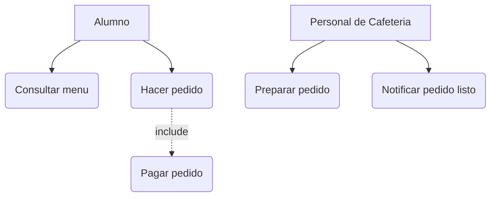
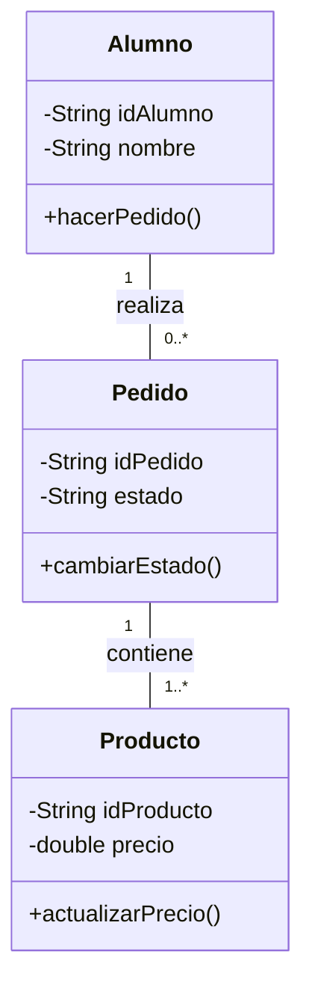
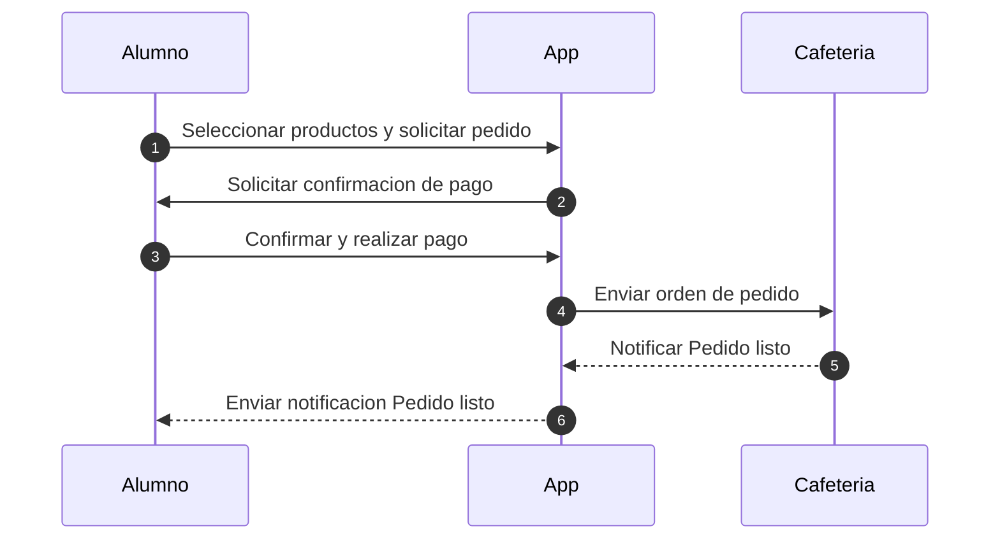

```mermaid
graph TD
    Alumno[Alumno] --> CU1(Consultar menu)
    Alumno --> CU2(Hacer pedido)
   CU2 -.->|include| CU3(Pagar pedido)
    
    P[Personal de Cafeteria] --> CU4(Preparar pedido)
    P --> CU5(Notificar pedido listo)
```

```mermaid
    classDiagram
    class Alumno {
        -String idAlumno
        -String nombre
        +hacerPedido()
    }
    class Pedido {
        -String idPedido
        -String estado
        +cambiarEstado()
    }
    class Producto {
        -String idProducto
        -double precio
        +actualizarPrecio()
    }

   Alumno "1" -- "0..*" Pedido : realiza
    Pedido "1" -- "1..*" Producto : contiene
```

```mermaid
    sequenceDiagram
    autonumber
    Alumno->>App: Seleccionar productos y solicitar pedido
    App->>Alumno: Solicitar confirmacion de pago
    Alumno->>App: Confirmar y realizar pago
    App->>Cafeteria: Enviar orden de pedido
    Cafeteria-->>App: Notificar Pedido listo

    App-->>Alumno: Enviar notificacion Pedido listo
```
